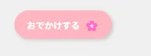

## 09: AI で修正しよう


しかし，もう少し修正するべき箇所がありそうです．

よく見るとトップ画像の上と左に余白があります．

CSS では，

```css linenums="1"
.top-image {
    width: 100%;
    height: 500px;
    object-fit: cover;
}
```

となっており，幅`width`は`100%`になっており，左右に関して，画面全体を覆うはずです．

しかし，そのようになっていません．

---

CSS でよくわからないことになったら，AI を使ってみましょう．

このようにプロンプトを書いてみました．

```
HTML+CSSで画像を横100%，縦500pxに表示させたいのですが，端っこに余白ができてしまいます．どうすれば余白を消せますか？


<!DOCTYPE html>

<html>
    <head>
        <!-- ページの設定などを書く -->
          <style>
            .contents-wrapper {
                padding: 50px 150px;
            }

			.hello-heading {
				color: #ff0000;
			}

			.logo-mark {
				width: 100px;  /* "width"は幅を指定するプロパティ*/
			}
 
            .top-image {
                width: 100%;
                height: 500px;
                object-fit: cover;
            }
         </style>
    </head>
    <body>
        
        <div class="contents-wrapper">
            <!-- ページの内容を書く -->
			
			<h1 class="hello-heading">こんにちは！</h1>
            <p>
                Lorem, ipsum dolor sit amet consectetur adipisicing elit. Perspiciatis,
                illum dolor. Aspernatur magni reiciendis labore totam et rem, quae
                voluptates accusantium quas facere sint voluptas cupiditate maxime nemo
                inventore numquam?
            </p>
            <h2>好きな食べ物</h2>
            <ul>
                <li>うどん</li>
                <li>ラーメン</li>
                <li>ピザ</li>
            </ul>

            <a href="https://x.com/japan">私のXプロフィールへ</a>
        </div>
    </body>
</html>
```

回答はこんな感じになりました 👀


実際にやってみましょう！

AI のアドバイスをもとに修正したコードは以下のようになります．

```html linenums="1" hl_lines="7-10"
<!DOCTYPE html>

<html>
    <head>
        <!-- ページの設定などを書く -->
          <style>
            html, body {
				margin: 0;
                padding: 0;
			}

            .contents-wrapper {
                padding: 50px 150px;
            }

			.hello-heading {
				color: #ff0000;
			}

			.logo-mark {
				width: 100px;  /* "width"は幅を指定するプロパティ*/
			}
 
            .top-image {
                width: 100%;
                height: 500px;
                object-fit: cover;
            }
         </style>
    </head>

...

```

実際にページを見ると，余白が消えています 🙌


もし，開発中にうまくいかないことがあったら，コードをコピペしながら質問すると解決策が見つけやすくなり，開発効率が上がります 🚀


??? note "今のコードはこちら！"
    ```html
    <!DOCTYPE html>

    <html>
        <head>
            <!-- ページの設定などを書く -->
            <style>
                html, body {
                    margin: 0;
                    padding: 0;
                }

                .contents-wrapper {
                    padding: 50px 150px;
                }

                .hello-heading {
                    color: #ff0000;
                }

                .logo-mark {
                    width: 100px;  /* "width"は幅を指定するプロパティ*/
                }
    
                .top-image {
                    width: 100%;
                    height: 500px;
                    object-fit: cover;
                }
            </style>
        </head>
        <body>
            
            <div class="contents-wrapper">
                <!-- ページの内容を書く -->
                
                <h1 class="hello-heading">こんにちは！</h1>
                <p>
                    Lorem, ipsum dolor sit amet consectetur adipisicing elit. Perspiciatis,
                    illum dolor. Aspernatur magni reiciendis labore totam et rem, quae
                    voluptates accusantium quas facere sint voluptas cupiditate maxime nemo
                    inventore numquam?
                </p>
                <h2>好きな食べ物</h2>
                <ul>
                    <li>うどん</li>
                    <li>ラーメン</li>
                    <li>ピザ</li>
                </ul>

                <a href="https://x.com/japan">私のXプロフィールへ</a>
            </div>
        </body>
    </html>
    ```


---

## 10: サイトを自由にカスタマイズしてみよう

最後に，サイトを自由にカスタマイズしてみましょう 🎨

このイベントでは，サイトをカスタマイズできるテンプレート素材を用意しています！

[このリポジトリ](https://github.com/KanadeSisido/welcome-gdgoc-2025)にアクセスして，試しにグラデーション入りのボタンを付けてみましょう．


`welcome-gdgoc-2025/Button/RoundedButton/`にアクセスします．


今回は「オレンジピール」と書かれたボタンを使いたいと思います．

`index.html`から「オレンジピール」と書かれたボタンをコピーします．

```html linenums="1"
<a href="#" class="gradation-link-button">オレンジピール</a>
```

また，ボタンにつけられている class を見て，CSS からもコードをコピーします．

```css
.gradation-link-button {
    /* reset default */
    text-decoration: none;
    outline:none;
    /* layout + shape */
    padding: 10px 20px;
    border-radius: 9999px;
    display:inline-block;
    /* color + design */
    background: linear-gradient(135deg, #ea8800,#ff0077);
    color: #fff;
    /* font */
    font-weight: 500;
    font-size: 16px;
    line-height: 2em;
}
.gradation-link-button:hover {
    background:linear-gradient(135deg, #d7a967, #ff6aaf);
}
```

このボタンを既存の`<a>`タグと取り替えましょう．

「オレンジピール」を「X のプロフィールへ」に変更し，URL も修正します 🖊️

```html linenums="1"
<a href="https://x.com/japan" class="gradation-link-button">
    Xプロフィールへ
</a>
```

この時点でのコードは以下のとおりです ✨️


```html linenums="1"
<!DOCTYPE html>

<html>
    <head>
        <!-- ページの設定などを書く -->
          <style>
            html, body {
				margin: 0;
                padding: 0;
			}

            .contents-wrapper {
                padding: 50px 150px;
            }

			.hello-heading {
				color: #ff0000;
			}

			.logo-mark {
				width: 100px;  /* "width"は幅を指定するプロパティ*/
			}
 
            .top-image {
                width: 100%;
                height: 500px;
                object-fit: cover;
            }
         </style>
    </head>
    <body>
        
        <div class="contents-wrapper">
            <!-- ページの内容を書く -->
			
			<h1 class="hello-heading">こんにちは！</h1>
            <p>
                Lorem, ipsum dolor sit amet consectetur adipisicing elit. Perspiciatis,
                illum dolor. Aspernatur magni reiciendis labore totam et rem, quae
                voluptates accusantium quas facere sint voluptas cupiditate maxime nemo
                inventore numquam?
            </p>
            <h2>好きな食べ物</h2>
            <ul>
                <li>うどん</li>
                <li>ラーメン</li>
                <li>ピザ</li>
            </ul>

            <a href="https://x.com/japan" class="gradation-link-button">
                Xプロフィールへ
            </a>
        </div>
    </body>
</html>
```

---

## 11: テンプレートにないデザインがほしいとき


最後に，テンプレートにないデザインがほしいときや，テンプレートのデザインを変更したいときの方法について説明します．

ほしいデザインや，加えたい表現があるとき，AI を活用しましょう．

今回は，スタイリッシュなボタンを AI に生成してもらいましょう！

このようにプロンプトを書いて，生成してもらいました．


出力された HTML と CSS を書いて，表示させてみたところ，このようなボタンができました ✨️


今度はかわいいボタンを AI に生成してもらいましょう！


出力された HTML と CSS を書いたら，可愛らしいボタンが表示されました！



AI の出力にはコードの解説もふくまれており，理解しながら作りたいデザインが簡単に実装できます 👏


他にも，Web ページの製作において，AI を活用できる場面は以下のようなものが考えられます．

- わからないこと，やりたい表現を AI と相談する　（top 画像の中央に文字を入れたい）
- ほしいデザインを作ってもらう（かわいいボタンを作って）
- エラー，バグを相談する（画像に謎の余白が………）

ぜひ AI とともに Web サイトを自分らしくカスタマイズしてみてください！


