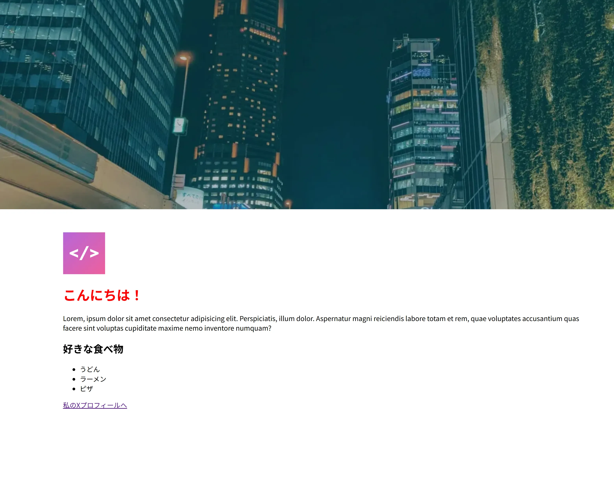

# GDGoC Japan Welcome Event 2025 @Google Shibuya Office

## 01: Intro

Web サイトを作りましょう！

今回のレクチャーではこんな感じのサイトを作ります！
基本的な HTML+CSS を学び，AI の活用方法にも触れていきます！


## 02: 土台を作成しよう！

さっそく始めましょう！
最初は Web サイトの土台を作ります.

以下のコードをコピペしてください 📋️

```html linenums="1"
<!DOCTYPE html>

<html>
	<head>
		/* ページの設定などを書く */
	</head>
	<body>
		/* ページの内容を書く */
	</body>
</html>
```

`!DOCTYPE html`はこのファイルが html ファイルであることを明示しています．

Web サイトで表示する要素は`<html>...</html>`などの「タグ」で囲う必要があります！

`html`タグの中を`head`と`body`という２つのタグで分割します．
`head`にはページの設定，`body`にはページの内容を書いていきます．

## 03: 文字を追加してみよう

早速文字を追加してみましょう！

### h1 とは

`<h1> ... </h1>`は見出しです．`h1`の他にも`h2`，`h3`，`h4`，……があり，数字が小さいほど，目立つようになっています．

つまり，`<h1>`には一番目立たせたい内容，例えばページのタイトル，章の名前などを書くことがあります．

このようにコードを加筆します！

### p とは

`<p> ... </p>`は段落を表現します．`p`は段落を意味する`"p"aragraph`の略です．

「Lorem」というちょっと長い文章を p タグの中に入れてみましょう．
長い文章でレイアウトを確認する際に使えるダミーテキストです．

```
Lorem, ipsum dolor sit amet consectetur adipisicing elit.
Perspiciatis, illum dolor. Aspernatur magni reiciendis labore totam et
rem, quae voluptates accusantium quas facere sint voluptas cupiditate
maxime nemo inventore numquam?
```

次のようになります．

```html linenums="1" hl_lines="9-15"
<!DOCTYPE html>

<html>
	<head>
		/* ページの設定などを書く */
	</head>
	<body>
		/* ページの内容を書く */
		<h1>こんにちは！</h1>
		<p>
			Lorem, ipsum dolor sit amet consectetur adipisicing elit. Perspiciatis,
			illum dolor. Aspernatur magni reiciendis labore totam et rem, quae
			voluptates accusantium quas facere sint voluptas cupiditate maxime nemo
			inventore numquam?
		</p>
	</body>
</html>
```

## 04: リンク・画像を追加しよう

リンク・画像を追加しましょう！

### リンクを追加

リンクを追加する際は`<a href="...."> ... </a>`を利用します．
`href`のあとにリンク先の URL を書くと，クリックしたときにページ遷移させることができます．

```
<!DOCTYPE html>

<html>
    <head>
    </head>
    <body>
        <h1>こんにちは！</h1>
        <p>
            Lorem, ipsum dolor sit amet consectetur adipisicing elit.
            Perspiciatis, illum dolor. Aspernatur magni reiciendis labore totam et
            rem, quae voluptates accusantium quas facere sint voluptas cupiditate
            maxime nemo inventore numquam?
        </p>
        <a href="https://x.com/japan">私のXプロフィールへ</a>
    </body>
</html>
```

`href`の設定によっては，フォルダ内の他のページにアクセスさせることもできます．

例えば，フォルダ内に別のページの HTML ファイル`mySubPage.html`がある場合，

※もしこんな感じのファイル構成の場合

```
|   index.html
|   styles.css
|   logo-mark.png
|   mySubPage.html
```

次のように書くとサブページへのリンクが作れます！

```
<!DOCTYPE html>

<html>
    <head>
    </head>
    <body>
        <h1>こんにちは！</h1>
        <p>
            Lorem, ipsum dolor sit amet consectetur adipisicing elit.
            Perspiciatis, illum dolor. Aspernatur magni reiciendis labore totam et
            rem, quae voluptates accusantium quas facere sint voluptas cupiditate
            maxime nemo inventore numquam?
        </p>
        <a href="mySubPage.html">サブページへ</a>
    </body>
</html>
```

### 画像を追加

リンクを追加する際は``を利用します．
`img`のあとに画像の名前（場所）を書くと，画像を表示できます．

```
<!DOCTYPE html>

<html>
    <head>
    </head>
    <body>
        
        <h1>こんにちは！</h1>
        <p>
            Lorem, ipsum dolor sit amet consectetur adipisicing elit.
            Perspiciatis, illum dolor. Aspernatur magni reiciendis labore totam et
            rem, quae voluptates accusantium quas facere sint voluptas cupiditate
            maxime nemo inventore numquam?
        </p>
        <a href="https://x.com/japan">私のXプロフィールへ</a>
    </body>
</html>
```


## 05: リストを作成してみよう

<!-- // TODO: <ul>と<li>の使い方を説明（好きな食べ物） -->

次に，自分の好きなものや，情報を列挙できるリストを作成してみましょう．
HTML でリストを作る際には`<ul> ... </ul>`と`<li> ... </li>`を使います．

リストは次のように書きます．

```
<ul>
    <li>リストの１つ目</li>
    <li>リストの２つ目</li>
    <li>リストの３つ目</li>
</ul>
```

上記のコードでこのようなリストができます．


サイトにも自分の好きな食べ物リストを作ってみましょう．

以下のコードを p タグの下に追記します．

```
<h2>好きな食べ物</h2>
<ul>
    <li>うどん</li>
    <li>ラーメン</li>
    <li>ピザ</li>
</ul>
```

コードはこんな感じになります．

```
<!DOCTYPE html>

<html>
    <head>
    </head>
    <body>
        
        <h1>こんにちは！</h1>
        <p>
            Lorem, ipsum dolor sit amet consectetur adipisicing elit.
            Perspiciatis, illum dolor. Aspernatur magni reiciendis labore totam et
            rem, quae voluptates accusantium quas facere sint voluptas cupiditate
            maxime nemo inventore numquam?
        </p>
        <h2>好きな食べ物</h2>
        <ul>
            <li>うどん</li>
            <li>ラーメン</li>
            <li>ピザ</li>
        </ul>
        <a href="https://x.com/japan">私のXプロフィールへ</a>
    </body>
</html>
```

# 06

<!-- // TODO: CSS に入り，class を使って h1（こんにちは！）に色付けする -->

ここからは，文字に色を付けたり，レイアウトを整えてみましょう！
HTML で作った要素を装飾するには，CSS を利用します．

まずは CSS を利用する設定を始めましょう．
CSS を利用するには`head`タグの中に，`style`タグを書きます！

※CSS を HTML ファイル内に書かず，別のファイルに書く方法もありますが，今回は同じファイルに書いていきます．

```
<!DOCTYPE html>

<html>
    <head>
        <style>

        </style>
    </head>
    <body>
        
        <h1>こんにちは！</h1>
        <p>
            Lorem, ipsum dolor sit amet consectetur adipisicing elit.
            Perspiciatis, illum dolor. Aspernatur magni reiciendis labore totam et
            rem, quae voluptates accusantium quas facere sint voluptas cupiditate
            maxime nemo inventore numquam?
        </p>
        <h2>好きな食べ物</h2>
        <ul>
            <li>うどん</li>
            <li>ラーメン</li>
            <li>ピザ</li>
        </ul>
        <a href="https://x.com/japan">私のXプロフィールへ</a>
    </body>
</html>
```

これで CSS の準備は OK です．
早速，「こんにちは！」に色をつけてみましょう．

HTML では class を使って，要素に名前をつけられます．その名前を用いて，CSS で見た目を整えます．

装飾したい要素に`class="..."`を追記しましょう．

こんな感じに追記します．

```
<h1 class="hello-heading">こんにちは！</h1>
```

コードはこんな感じになります．

```
<!DOCTYPE html>

<html>
    <head>
        <style>

        </style>
    </head>
    <body>
        
        <h1 class="hello-heading">こんにちは！</h1>
        <p>
            Lorem, ipsum dolor sit amet consectetur adipisicing elit.
            Perspiciatis, illum dolor. Aspernatur magni reiciendis labore totam et
            rem, quae voluptates accusantium quas facere sint voluptas cupiditate
            maxime nemo inventore numquam?
        </p>
        <h2>好きな食べ物</h2>
        <ul>
            <li>うどん</li>
            <li>ラーメン</li>
            <li>ピザ</li>
        </ul>
        <a href="https://x.com/japan">私のXプロフィールへ</a>
    </body>
</html>
```

class 名として`hello-heading`と書きましたが，これは好きな文字列でも OK です．

次に，`<styles> ... </styles>`の中に以下のコードを書いてください．

```
.hello-heading {
    color: #ff0000;
}
```

`color`は文字の色を変更させるプロパティで，まずは文字を赤くしてみます．

コードはこんな感じになります．

```
<!DOCTYPE html>

<html>
    <head>
        <style>
            .hello-heading {
                color: #ff0000;
            }
        </style>
    </head>
    <body>
        
        <h1 class="hello-heading">こんにちは！</h1>
        <p>
            Lorem, ipsum dolor sit amet consectetur adipisicing elit.
            Perspiciatis, illum dolor. Aspernatur magni reiciendis labore totam et
            rem, quae voluptates accusantium quas facere sint voluptas cupiditate
            maxime nemo inventore numquam?
        </p>
        <h2>好きな食べ物</h2>
        <ul>
            <li>うどん</li>
            <li>ラーメン</li>
            <li>ピザ</li>
        </ul>
        <a href="https://x.com/japan">私のXプロフィールへ</a>
    </body>
</html>
```

もし，class 名を好きな文字列にした場合は，CSS の`hello-heading`の部分は自分がつけた class 名に書き換えてください．

すると，このように文字に色がつきます！


# 07

今度はロゴマークを小さくしてみましょう．

img タグに適当な class をつけます．

こんな感じにつけます．

```

```

コードはこんな感じになります．

```
<!DOCTYPE html>

<html>
    <head>
        <style>
            .hello-heading {
                color: #ff0000;
            }
        </style>
    </head>
    <body>
        
        <h1 class="hello-heading">こんにちは！</h1>
        <p>
            Lorem, ipsum dolor sit amet consectetur adipisicing elit.
            Perspiciatis, illum dolor. Aspernatur magni reiciendis labore totam et
            rem, quae voluptates accusantium quas facere sint voluptas cupiditate
            maxime nemo inventore numquam?
        </p>
        <h2>好きな食べ物</h2>
        <ul>
            <li>うどん</li>
            <li>ラーメン</li>
            <li>ピザ</li>
        </ul>
        <a href="https://x.com/japan">私のXプロフィールへ</a>
    </body>
</html>
```

ここでは class を`logo-mark`としましたが，好きな文字列でも OK です．

次に，CSS に以下のコードを追記します．（既存のコードの上でも下でも大丈夫です！）

```
.logo-mark {
    width: 100px;  /* "width"は幅を指定するプロパティ*/
}
```

もし，class 名を好きな文字列にした場合は，CSS の`logo-mark`の部分は自分がつけた class 名に書き換えてください．

コードはこんな感じになります．

```
<!DOCTYPE html>

<html>
    <head>
        <style>
            .hello-heading {
                color: #ff0000;
            }

            .logo-mark {
                width: 100px;  /* "width"は幅を指定するプロパティ*/
            }
        </style>
    </head>
    <body>
        
        <h1 class="hello-heading">こんにちは！</h1>
        <p>
            Lorem, ipsum dolor sit amet consectetur adipisicing elit.
            Perspiciatis, illum dolor. Aspernatur magni reiciendis labore totam et
            rem, quae voluptates accusantium quas facere sint voluptas cupiditate
            maxime nemo inventore numquam?
        </p>
        <h2>好きな食べ物</h2>
        <ul>
            <li>うどん</li>
            <li>ラーメン</li>
            <li>ピザ</li>
        </ul>
        <a href="https://x.com/japan">私のXプロフィールへ</a>
    </body>
</html>
```

再度ページを確認すると，このようにロゴマークの大きさが変わります！


コードはこんな感じです！

```
<!DOCTYPE html>

<html>
	<head>
		<style>
			body {
				background-color: #f0f0f0;
			}

			.hello-heading {
				color: #ff0000;
			}

			.logo-mark {
				width: 100px;
				border-radius: 999px;
				border: #999 2px solid;
			}
		</style>
	</head>
	<body>
		
		<h1 class="hello-heading">こんにちは！</h1>
		<p>
			Lorem, ipsum dolor sit amet consectetur adipisicing elit. Perspiciatis,
			illum dolor. Aspernatur magni reiciendis labore totam et rem, quae
			voluptates accusantium quas facere sint voluptas cupiditate maxime nemo
			inventore numquam?
		</p>
		<h2>好きな食べ物</h2>
		<ul>
			<li>うどん</li>
			<li>ラーメン</li>
			<li>ピザ</li>
		</ul>
		<a href="https://x.com/japan">私のXプロフィールへ</a>
	</body>
</html>

```

# 08

ここからは，HTML と CSS を使って，見た目を変えていきましょう 👀

まずは背景色を変更します．

CSS で背景色を変更する場合は`background-color`プロパティを利用します．

✅️ 文字色を変えるのが`color`で，背景色を変えるのが`background-color`です！

画面全体に背景色を入れたいので，`body`タグにスタイルを適用します．

以下のコードを`style`タグの中に入れてください．

```
body {
    background-color: #f0f0f0;
}
```

※今回は`.body`じゃなく`body`になっていることにお気づきでしょうか．class を使う場合は`.(ドット)`を使い，単にタグ名で指定する場合は`body`のようにそのまま書きます．

コードは以下のようになります．

```
<!DOCTYPE html>

<html>
    <head>
        <style>
            body {
                background-color: #f0f0f0;
            }

            .hello-heading {
                color: #ff0000;
            }

            .logo-mark {
                width: 100px;  /* "width"は幅を指定するプロパティ*/
            }

        </style>
    </head>
    <body>
        
        <h1 class="hello-heading">こんにちは！</h1>
        <p>
            Lorem, ipsum dolor sit amet consectetur adipisicing elit.
            Perspiciatis, illum dolor. Aspernatur magni reiciendis labore totam et
            rem, quae voluptates accusantium quas facere sint voluptas cupiditate
            maxime nemo inventore numquam?
        </p>
        <h2>好きな食べ物</h2>
        <ul>
            <li>うどん</li>
            <li>ラーメン</li>
            <li>ピザ</li>
        </ul>
        <a href="https://x.com/japan">私のXプロフィールへ</a>
    </body>
</html>
```

# 09

<!-- ロゴを丸くする方法を解説し(border-radius)，ボーダをつける（border）方法を解説する -->

ロゴに枠線をつけて，丸く切り取ってみましょう！

## 枠線をつける

要素に枠線をつけるには`border`プロパティを使います．

今回はロゴに灰色の枠線をつけてみます．次のように追記してください！

```
.logo-mark {
    width: 100px;
    border: #999 2px solid;
}
```


ここでは，灰色（`#999`）で，枠線のサイズが`2px`の枠線をつけています．

## 丸く切り取る

要素を丸く切り取るには`border-radius`プロパティを使います．

もともと`border-radius`プロパティは，角を丸めるプロパティですが，丸める度合いを大きくすると，円に切り取ることができます．

以下のように追記してみましょう！

```
.logo-mark {
    width: 100px;
    border: #999 2px solid;
    border-radius: 20px;
}
```

こんな感じに角が丸くなります．



丸める度合いを非常に大きな値，`999px`にしてみましょう．

```
.logo-mark {
    width: 100px;
    border: #999 2px solid;
    border-radius: 999px;
}
```

すると，円になります！


# 10

<!-- top-image（shibuya.webp）を入れる．すると，サイズが良くないので，以下のCSSを適用する -->

ページにメイン画像を追加しましょう！

画像の追加には``を使います．
まずは以下のコードのように，そのまま追加しましょう．

```

```

`.webp`は画像フォーマット「WebP」の拡張子です．

以下のように，img タグを追加します．また，このあとのために class として`top-image`を追加しておきます．

```
<!DOCTYPE html>

<html>
    <head>

         ...(コード略)

    </head>
    <body>
        
        
        <h1 class="hello-heading">こんにちは！</h1>
        <p>
            Lorem, ipsum dolor sit amet consectetur adipisicing elit.
            Perspiciatis, illum dolor. Aspernatur magni reiciendis labore totam et
            rem, quae voluptates accusantium quas facere sint voluptas cupiditate
            maxime nemo inventore numquam?
        </p>
        <h2>好きな食べ物</h2>
        <ul>
            <li>うどん</li>
            <li>ラーメン</li>
            <li>ピザ</li>
        </ul>
        <a href="https://x.com/japan">私のXプロフィールへ</a>
    </body>
</html>
```


画像が追加されました 🙌

しかし，少し幅が足りないので，横幅を画面いっぱいにします．
また，高さも`500px`にします．

その際は，以下のような CSS を`style`の中に追記します．

```
.top-image {
    width: 100%;
    height: 500px;
}
```

今の状況を見てみましょう．


見た目はいい感じですが，実は横に引き伸ばされてしまっています．

そのため，いい感じに調整します．調整には`object-fit: cover;`というプロパティを用います．

<!-- しかしこれではアスペクト比が良くないので，次のようにする． -->

こんな感じに CSS の`top-image`に追記します．

```
.top-image {
    width: 100%;
    height: 500px;
    object-fit: cover;
}
```


少し分かりづらいですが，縦横比が画像の拡大により，ちょうどいい状態になっていることがわかります．

# 11

しかし，もう少し修正するべき箇所がありそうです．

トップ画像の上と横に余白ができてしまっています．

CSS では，

```
.top-image {
    width: 100%;
    height: 500px;
    object-fit: cover;
}
```

となっており，幅`width`は`100%`になっており，左右に関して，画面全体を覆うはずです．

しかし，そのようになっていません．

CSS でよくわからないことになったら，AI を使ってみましょう．

このようにプロンプトを書いてみました．

```
HTML+CSSで画像を横100%，縦500pxに表示させたいのですが，端っこに余白ができてしまいます．どうすれば余白を消せますか？

<!DOCTYPE html>

<html>
	<head>
		<style>
			body {
				background-color: #f0f0f0;
			}

			.top-image {
				width: 100%;
				height: 500px;
				object-fit: cover;
			}

			.hello-heading {
				color: #ff0000;
			}
			.logo-mark {
				width: 100px;
				border-radius: 999px;
				border: #999 2px solid;
			}
		</style>
	</head>
	<body>
		
				
				<h1 class="hello-heading">こんにちは！</h1>
				<p>
					Lorem, ipsum dolor sit amet consectetur adipisicing elit.
					Perspiciatis, illum dolor. Aspernatur magni reiciendis labore totam et
					rem, quae voluptates accusantium quas facere sint voluptas cupiditate
					maxime nemo inventore numquam?
				</p>
				<h2>好きなたべもの</h2>
				<ul>
					<li>うどん</li>
					<li>ラーメン</li>
					<li>ピザ</li>
				</ul>
			<a href="https://x.com/japan" class="my-profile-link"
				>私のXプロフィールへ</a
			>
			<a href="#" class="gradation-link-button">オレンジピール</a>
	</body>
</html>


```

回答はこんな感じになりました 👀

```
画像を横幅いっぱいに表示しようとしたときに余白ができてしまうのですね。原因として考えられるのは、<body> や  タグにデフォルトで設定されているマージンやパディングです。

以下のいずれかの方法を試してみてください。

方法1: body のマージンを削除する
CSSに以下の記述を追加することで、body 要素のデフォルトのマージンをなくし、画像の端がブラウザの端にぴったりとくっつくようにできます。

CSS
body {
  background-color: #f0f0f0;
  margin: 0; /* 追加 */
}

...

```

実際にやってみましょう！

AI のアドバイスをもとに修正したコードは以下のようになります．

```
<!DOCTYPE html>

<html>
	<head>
		<style>
			body {
				margin: 0; /* 追加 */
				background-color: #f0f0f0;
			}

			.hello-heading {
				color: #ff0000;
			}

			.logo-mark {
				width: 100px; /* "width"は幅を指定するプロパティ*/
				border: #999 2px solid;
				border-radius: 999px;
			}
			.top-image {
				width: 100%;
				height: 500px;
				object-fit: cover;
			}
		</style>
	</head>
	<body>
	</head>
    <body>
        
        
        <h1 class="hello-heading">こんにちは！</h1>
        <p>
            Lorem, ipsum dolor sit amet consectetur adipisicing elit.
            Perspiciatis, illum dolor. Aspernatur magni reiciendis labore totam et
            rem, quae voluptates accusantium quas facere sint voluptas cupiditate
            maxime nemo inventore numquam?
        </p>
        <h2>好きな食べ物</h2>
        <ul>
            <li>うどん</li>
            <li>ラーメン</li>
            <li>ピザ</li>
        </ul>
        <a href="https://x.com/japan">私のXプロフィールへ</a>
    </body>
</html>

```

実際にページを見ると，余白が消えています 🙌


もし，開発中にうまくいかないことがあったら，コードをコピペしながら質問すると解決策が見つけやすくなり，開発効率が上がります 🚀

# 12

<!-- divによるwrappingを説明する．以下のcontents-wrapperやcontentのように，構造化して扱いやすいタグの構造にすることを説明する -->

無事，トップ画像が表示されました 🙌

さて，ここからは，コンテンツの余白を修正していきましょう．

具体的には，もう少しアイコンや文字を真ん中の方へ持っていきたいです．

また，次のグループにまとめて，各グループ間に余白を入れたいです．

- ロゴと「こんにちは！」と文章
- 好きな食べ物リスト

<br>

また，ここまでコードを書いてきて，少しコードの量が多くなってきました．そのため，いくつかの要素をグループ化して，構造的にすると，コードが書きやすい HTML ファイルになります．

構造化の方針としては，以下のようなグループにまとめていきます．


<br>

HTML ファイルを構造化するときに使われるのは `<div> ... </div>` タグです．

`div`を用いると，以下のようにタグをまとめられます．

```
<div>
    <h1>Hello!</h1>
    <p>Hello HTML+CSS!</p>
    <a href="sub.html">SubPage</a>
</div>
```

早速`div`を利用してグループにまとめましょう．

まずは，ロゴと「こんにちは！」の文字，文章をまとめます．

余白をつけるには CSS を利用するので，`div`に class として`contents`をつけておきます．

```
<div class="contents">
    
    <h1 class="hello-heading">こんにちは！</h1>
    <p>
        Lorem, ipsum dolor sit amet consectetur adipisicing elit.
        Perspiciatis, illum dolor. Aspernatur magni reiciendis labore totam et
        rem, quae voluptates accusantium quas facere sint voluptas cupiditate
        maxime nemo inventore numquam?
    </p>
</div>
```

同様に「好きなたべもの」リストも`div`タグでまとめ，class として`contents`をつけます．

```
<div class="contents">
    <h2>好きなたべもの</h2>
    <ul>
        <li>うどん</li>
        <li>ラーメン</li>
        <li>ピザ</li>
    </ul>
</div>
```

X のプロフィールリンクも同様にします．

```
<div class="contents">
    <a href="https://x.com/japan" class="my-profile-link"
        >私のXプロフィールへ</a
    >
</div>
```

これに加えて，表示するコンテンツ全てを覆う`div`タグを作り，class として`contents-wrapper`を作ります．これは必須ではありませんが，画面のコンテンツ全てを中央に寄せたいときに便利なのでつけておきます．

```
<div class="contents-wrapper">
    
    <div class="contents">
        <h1 class="hello-heading">こんにちは！</h1>
        <p>
            Lorem, ipsum dolor sit amet consectetur adipisicing elit.
            Perspiciatis, illum dolor. Aspernatur magni reiciendis labore totam et
            rem, quae voluptates accusantium quas facere sint voluptas cupiditate
            maxime nemo inventore numquam?
        </p>
    </div>
    <div class="contents">
        <h2>好きなたべもの</h2>
        <ul>
            <li>うどん</li>
            <li>ラーメン</li>
            <li>ピザ</li>
        </ul>
    </div>
    <div class="contents">
        <a href="https://x.com/japan" class="my-profile-link"
            >私のXプロフィールへ</a
        >
    </div>
</div>
```

これでコードが構造的になりました！

次のセクションでは，このコードを利用して，余白を付けていきます．

いよいよラストスパートです 🙌

# 13

<!-- 適切な余白をつける方法を解説する，margin，paddingについて説明．
contents-wrapperは，中の要素について余白を開けるので`padding`を使う．
また，paddingのオプションは -->

前回作成したコードをもとに，各要素に余白を付けていきます．

CSS で余白をつけるためには，主に`margin`と`padding`が使われます．

- ある要素の**外側**に余白をつけるのが`margin`で，
- ある要素の**内側**に余白をつけるのが`padding`です．

それぞれいくつか書き方があります．

```
margin: <幅>;
margin: <上下> <左右>;
margin: <上> <右> <下> <左>
```

```
padding: <幅>;
padding: <上下> <左右>;
padding: <上> <右> <下> <左>
```

<!-- になっていることを説明する，忘れたらAIに聞くのもいいよね，って話もする -->

まずは横方向に余白を空けましょう！

前回作成した`<div class="contents-wrapper"> ... </div>`の**内側**にある要素全てを，`150px`くらい左右中央に寄せましょう．

```
.contents-wrapper {
    padding: 0 150px;
}
```


<!-- でコンテンツをいい感じに中央がわに持って行く

好きなたべものやloremの文の余白は以下のCSSで開ける -->

左右に余白がついて，見やすくなりました ✨️
今度は，縦方向に幅をもたせつつ，各グループ間に余白を空けましょう．

前回用意した`<div class="contents"> ... </div>`の**外側**に縦方向の余白を空けましょう．

```
.contents {
    margin: 50px 0;
}
```


余白がいい感じにつきました 🎉

<!-- この時点での制作物はこんな感じ -->

いま，コードはこんな感じになっています．

```
<!DOCTYPE html>

<html>
	<head>
		<style>
			body {
				margin: 0;
				background-color: #f0f0f0;
			}

			.contents-wrapper {
				padding: 0 150px;
			}
			.contents {
				margin: 50px 0;
			}

			.hello-heading {
				color: #ff0000;
			}

			.logo-mark {
				width: 100px; /* "width"は幅を指定するプロパティ*/
				border: #999 2px solid;
				border-radius: 999px;
			}
			.top-image {
				width: 100%;
				height: 500px;
				object-fit: cover;
			}
		</style>
	</head>
	<body>
		
		<div class="contents-wrapper">
			<div class="contents">
				
				<h1 class="hello-heading">こんにちは！</h1>
				<p>
					Lorem, ipsum dolor sit amet consectetur adipisicing elit.
					Perspiciatis, illum dolor. Aspernatur magni reiciendis labore totam et
					rem, quae voluptates accusantium quas facere sint voluptas cupiditate
					maxime nemo inventore numquam?
				</p>
			</div>
			<div class="contents">
				<h2>好きなたべもの</h2>
				<ul>
					<li>うどん</li>
					<li>ラーメン</li>
					<li>ピザ</li>
				</ul>
			</div>
			<div class="contents">
				<a href="https://x.com/japan">私のXプロフィールへ</a>
			</div>
		</div>
	</body>
</html>

```

# 14

最後に，サイトを自由にカスタマイズしてみましょう 🎨

このイベントでは，サイトをカスタマイズできるテンプレート素材を用意しています！

[このリポジトリ](https://github.com/KanadeSisido/welcome-gdgoc-2025)にアクセスして，試しにグラデーション入りのボタンを付けてみましょう．


`welcome-gdgoc-2025/Button/RoundedButton/`にアクセスします．


今回は「オレンジピール」と書かれたボタンを使いたいと思います．

`index.html`から「オレンジピール」と書かれたボタンをコピーします．

```
<a href="#" class="gradation-link-button">オレンジピール</a>
```

また，ボタンにつけられている class を見て，CSS からもコードをコピーします．

```
.gradation-link-button {
	/* reset default */
	text-decoration: none;
	outline: none;

	/* layout + shape */
	padding: 10px 20px;
	border-radius: 9999px;
	display: inline-block;

	/* color + design */
	background: linear-gradient(135deg, #ea8800, #ff0077);
	color: #fff;

	/* font */
	font-weight: 500;
	font-size: 16px;
	line-height: 2em;
}

.gradation-link-button:hover {
	background: linear-gradient(135deg, #d7a967, #ff6aaf);
}
```

このボタンを既存の`<a>`タグと取り替えましょう．

「オレンジピール」を「X のプロフィールへ」に変更し，URL も修正します 🖊️

```
<div class="contents">
    <a href="https://x.com/japan" class="gradation-link-button">Xプロフィールへ</a>
</div>
```

この時点でのコードは以下のとおりです ✨️

<!--

テンプレートの使い方を説明する． 今回はButton/RoundedButtonの「オレンジピール」を使う．
HTMLとCSSをコピペしてみる（１つ目のコード）

これを修正して，「オレンジピール」を「私のXプロフィールへ」に変更，URLも変更する．

-->

```
<!DOCTYPE html>

<html>
	<head>
		<style>
			body {
				margin: 0;
				background-color: #f0f0f0;
			}

			.contents-wrapper {
				padding: 0 150px;
			}
			.contents {
				margin: 50px 0;
			}

			.hello-heading {
				color: #ff0000;
			}

			.logo-mark {
				width: 100px; /* "width"は幅を指定するプロパティ*/
				border: #999 2px solid;
				border-radius: 999px;
			}
			.top-image {
				width: 100%;
				height: 500px;
				object-fit: cover;
			}

            .gradation-link-button {
                /* reset default */
                text-decoration: none;
                outline: none;

                /* layout + shape */
                padding: 10px 20px;
                border-radius: 9999px;
                display: inline-block;

                /* color + design */
                background: linear-gradient(135deg, #ea8800, #ff0077);
                color: #fff;

                /* font */
                font-weight: 500;
                font-size: 16px;
                line-height: 2em;
            }

            .gradation-link-button:hover {
                background: linear-gradient(135deg, #d7a967, #ff6aaf);
            }
		</style>
	</head>
	<body>
		
		<div class="contents-wrapper">
			<div class="contents">
				
				<h1 class="hello-heading">こんにちは！</h1>
				<p>
					Lorem, ipsum dolor sit amet consectetur adipisicing elit.
					Perspiciatis, illum dolor. Aspernatur magni reiciendis labore totam et
					rem, quae voluptates accusantium quas facere sint voluptas cupiditate
					maxime nemo inventore numquam?
				</p>
			</div>
			<div class="contents">
				<h2>好きなたべもの</h2>
				<ul>
					<li>うどん</li>
					<li>ラーメン</li>
					<li>ピザ</li>
				</ul>
			</div>
			<div class="contents">
                <a href="https://x.com/japan" class="gradation-link-button">Xプロフィールへ</a>
            </div>
		</div>
	</body>
</html>

```

# 15

最後に，テンプレートにないデザインがほしいときや，テンプレートのデザインを変更したいときの方法について説明します．

ほしいデザインや，加えたい表現があるとき，AI を活用しましょう．

今回は，スタイリッシュなボタンを AI に生成してもらいましょう！

このようにプロンプトを書いて，生成してもらいました．


出力された HTML と CSS を書いて，表示させてみたところ，このようなボタンができました ✨️


今度はかわいいボタンを AI に生成してもらいました！


出力された HTML と CSS を書いたら，可愛らしいボタンが表示されました！


AI の出力にはコードの解説もふくまれており，理解しながら作りたいデザインが簡単に実装できます 👏


他にも，Web ページの製作において，AI を活用できる場面は以下のようなものが考えられます．

- わからないこと，やりたい表現を AI と相談する　（top 画像の中央に文字を入れたい）
- ほしいデザインを作ってもらう（かわいいボタンを作って）
- エラー，バグを相談する（画像に謎の余白が………）

ぜひ想像を AI とともに Web サイトで表現してみてください！
